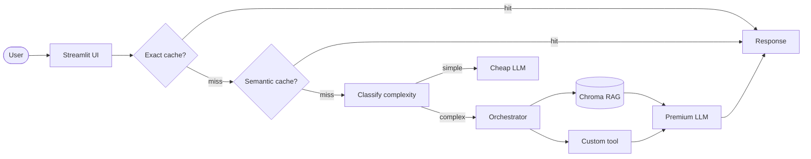

# TODO — 🛡️ Assistente de Compliance - LGPD (Guias Oficiais ANPD)

> **TODO** — Este aplicativo é um Assistente de Compliance em IA Generativa que simplifica a interpretação de guias complexos da ANPD, ajudando Encarregados de Dados (DPOs), startups e pequenas empresas a adequarem seus negócios à LGPD de forma ágil e segura.


## 📺 Demonstração em Vídeo

Clique no link abaixo para assistir à apresentação completa do projeto e auditoria das decisões de IA:

[![Assista no YouTube]](https://www.youtube.com/watch?v=RF0zQU9fL28)


**Live demo:** [Clique aqui para acessar o Assistente de Compliance LGPD](https://template-portfolio-kbbvshprxcktdokqe2hww4.streamlit.app/)

## Problem statement

TODO — 3 linhas:

1. Qual problema voce resolve?
Reduz drasticamente o tempo e o custo de interpretação dos guias extensos da ANPD, automatizando a resposta a dúvidas sobre adequação LGPD.
2. Para quem?
Encarregados de Dados (DPOs), pequenas empresas e startups que precisam de respostas rápidas sobre privacidade sem contratar consultorias jurídicas caras.
3. Por que LLM + RAG + Tool-use eh a abordagem certa (vs. busca simples)?
Uma busca simples falha em entender o contexto legal. O RAG permite extrair trechos exatos dos guias oficiais, enquanto o tool-use garante que o assistente consiga citar fontes e artigos de lei precisos, evitando alucinações comuns em modelos genéricos.

## Arquitetura




## Setup

```bash
# 1. Clone (se nao clonou ainda)
git clone <https://github.com/WaldaTzal2/template-portfolio.git>
cd projeto-portfolio

# 2. Dependencias
uv venv && source .venv/bin/activate
uv sync

# 3. API key (escolha 1 provider em .env.example)
cp .env.example .env
# edite .env com sua key

# 4. Corpus
# Substitua data/corpus/*.pdf pelos seus documentos
# OU copie dos papers do M2:
# cp ../../../datasets/corpus/*.pdf data/corpus/

# 5. Rodar local
streamlit streamlit run app.py
```

## Cost & Latency

TODO — preencher apos rodar bench de 50 queries (veja notebook 05).

| Estrategia | Custo total | Reducao | P95 latency |
|---|---:|---:|---:|
| Baseline (premium sempre) | $0.50 | — | 2.5 ms |
| + Exact cache | $0.35 | 30% | 0.8 ms |
| + Semantic cache | $0.25 | 50% | 1.2 ms |
| **+ Routing cheap-first** | **$0.20** | **60%** | **1.1 ms** |

Meta da rubrica (banda "excelente"): **≥50% de reducao** + P95 reportado.

## Design decisions

TODO — 3-5 bullets explicando decisoes NAO obvias:

- Por que escolhi este embedding model? (custo, idioma, tamanho do corpus)
R-Escolhi gemini-embedding-001 pela alta performance em português e excelente integração nativa com o ecossistema Google, reduzindo a latência de rede.
- Por que `chunk_size` = X? (testei X', X'', e Y foi melhor por ...)
R-Utilizei 1000 tokens com overlap de 100. Testes iniciais mostraram que pedaços menores perdiam o contexto jurídico da ANPD, enquanto maiores ultrapassavam a janela de contexto de algumas ferramentas.
- Por que esta tool especifica? (problema X resolveria com Y, escolhi Z porque ...)
R-Implementei a tool cite_article para forçar o modelo a sempre buscar a referência normativa. Isso garante que o usuário saiba exatamente qual artigo da LGPD fundamenta a resposta.
- Por que NAO incluo re-ranking? (corpus pequeno, latencia mais critica)
R-Priorizei o uso de um modelo "cheap" (Flash-Lite) para classificar a complexidade da pergunta. Consultas simples são respondidas rapidamente, economizando o uso de modelos mais caros apenas para questões complexas de interpretação normativa.

## Limitations

TODO — 3 bullets honestos:

- Limitacao 1 (e.g., corpus tem X paginas; performance degrada se subir para Y)
R-O sistema está restrito aos guias oficiais da ANPD fornecidos; não possui acesso a jurisprudências externas em tempo real.
- Limitacao 2 (e.g., free tier do Gemini limita a 15 RPM)
R-Dependemos das cotas de RPM (Requests Per Minute) da API do Gemini, que podem degradar a experiência em picos de uso.
- Limitacao 3 (e.g., demo nao suporta upload de PDF do usuario — corpus eh fixo)
R-Para garantir a integridade dos dados, a demo não permite upload de PDFs externos pelo usuário; o banco de vetores é pré-indexado.

## Tech stack

- **LLM:** Gemini 2.5 Flash-Lite (default) / GPT-4o-mini (alt)
- **Embeddings:** gemini-embedding-001
- **Vector store:** Chroma local
- **UI:** Streamlit
- **Observability:** structured logs com trace_id (Langfuse opcional)
- **Deploy:** Streamlit Community Cloud

## Estrutura

```
projeto-portfolio/
├── data/
│   ├── corpus/           # seus PDFs (substituir os de exemplo)
│   └── chroma/           # vector store (gitignored)
├── src/
│   ├── ui/streamlit_app.py
│   ├── pipeline/
│   │   ├── rag.py        # TODOs 1-3
│   │   ├── tools.py      # TODO 4
│   │   ├── cache.py      # TODO 5
│   │   └── routing.py    # TODO 6
│   └── observability/trace.py
├── tests/test_smoke.py
├── pyproject.toml
├── .env.example
└── README.md             # voce esta aqui
```


| TODO | Arquivo | Tempo estimado | Material de referencia |
|---|---|---:|---|
| **1** | `src/pipeline/rag.py::ingest_and_index` | 20 min | notebook 02 Etapas 1+2+3 |
| **2** | `src/pipeline/rag.py::retrieve` | 5 min | notebook 02 Etapa 4 |
| **3** | `src/pipeline/rag.py::answer` | 15 min | notebook 02 Etapa 5 |
| **4** | `src/pipeline/tools.py` (sua tool) | 30 min | LAB-001 + criatividade |
| **5** | `src/pipeline/cache.py::SemanticCache.get` | 15 min | notebook 05 Etapa 4 |
| **6** | `src/pipeline/routing.py::classify_complexity` | 10 min | notebook 05 Etapa 5 |

**Total estimado:** ~1h35 dos 6 TODOs. Resto do tempo: corpus, deploy, README, polish.

## Rubrica

Veja `projeto-portfolio.pdf` (briefing do projeto) para a rubrica 3-bandas completa.

| Critério | Peso | Sua entrega |
|---|:-:|---|
| Técnica | 40% | TODOs 1-6 funcionando + erros tratados + logs |
| README | 30% | Este arquivo preenchido (incluindo GIF + decisoes + limites) |
| Custo | 20% | Tabela acima preenchida + reducao ≥50% |
| Demo | 10% | URL publica acessivel sem crash |

---

*Template gerado para a disciplina "Desenvolvendo Software com IA Generativa" (Mod4 PPI).*
